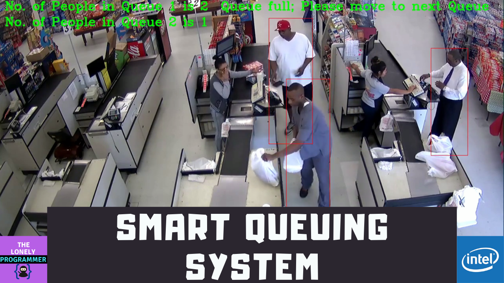

# Smart-Queuing-System
Build custom queuing systems for the retail, manufacturing and transportation sectors and use the Intel® DevCloud for the Edge to test your solutions performance.

## Demo Video of the Project - link

---

## Main Tasks
The following pages will walk you through the steps of the project. At a high level, you will:

1. Propose a possible hardware solution
2. Build out your application and test its performance on the DevCloud using multiple hardware types
3. Compare the performance to see which hardware performed best
4. Revise your proposal based on the test results

## Project - Subdomain

* [Manufacturing Scenario](./Manufacturing_Scenario.ipynb) 
* [Retail Scenario](./Retail_Scenario.ipynb)
* [Transportation Scenario](./Transportation_Scenario.ipynb) 

---

*If you faced any issues in building this project, feel free to ask me. Please do suggest new projects that you want me to do next.*

*Share this video if you like.*

*Blog - https://rahulthelonelyprogrammer.blogspot.in/*

*Github - https://github.com/Rahul24-06*

*Instagram - https://www.instagram.com/the_lonely_programmer/*

*Happy to have you subscribed: https://www.youtube.com/c/rahulkhanna24june?sub_confirmation=1*

**Thanks for reading!**
